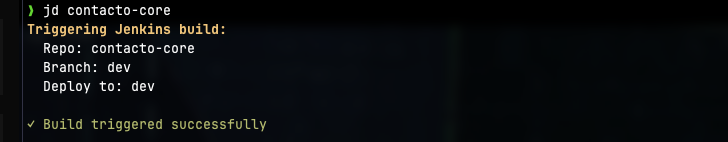
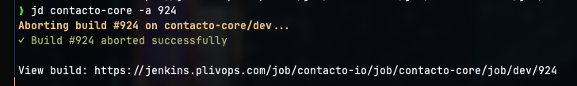

# jd - Jenkins Deploy

Deploy contacto projects from terminal. Trigger builds, watch logs, check status, abort builds.

## Screenshots






## Setup

```bash
export JENKINS_USER='your-username'
export JENKINS_TOKEN='your-api-token'  # Get from Jenkins > Your Name > Configure > API Token
```

## Usage

```bash
jd.sh [REPO] [BRANCH] [OPTIONS]
```

Defaults: `contacto-console` repo, `dev` branch, `dev` environment

## Features

| Flag | Description | Example |
|------|-------------|---------|
| (none) | Trigger build | `jd.sh` or `jd.sh contacto-api staging` |
| `--prod` | Deploy to production | `jd.sh contacto-console main --prod` |
| `-w` | Watch - stream live logs | `jd.sh -w` |
| `-s` | Status - show last 10 builds | `jd.sh -s` |
| `-a NUM` | Abort build | `jd.sh -a 3390` |
| `-i` | Interactive - fzf picker | `jd.sh -i` |

Combine flags: `jd.sh -i -w` (interactive + watch)

Requires: `curl`, `python3` (pre-installed), `fzf` (for `-i`, install via `brew install fzf`)
